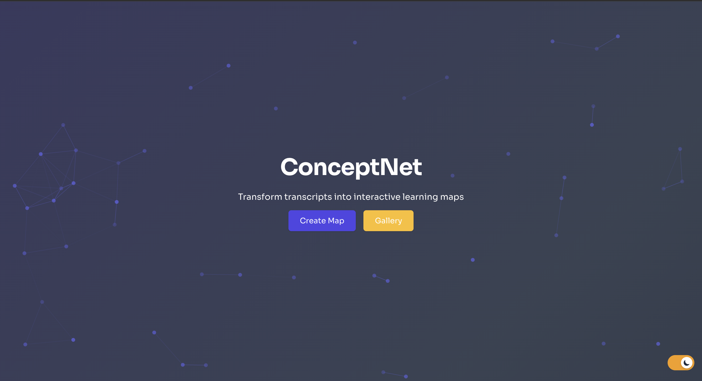
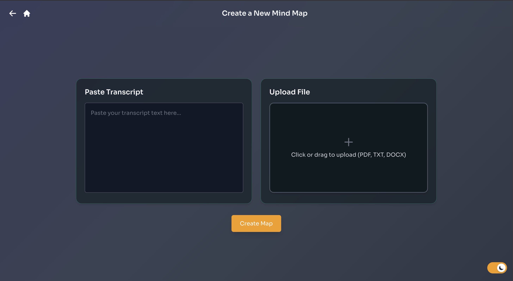
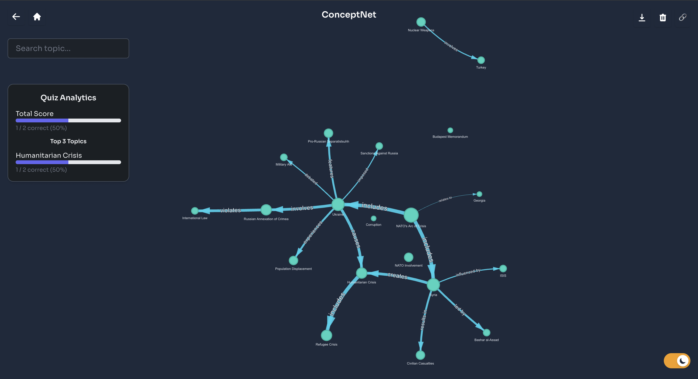
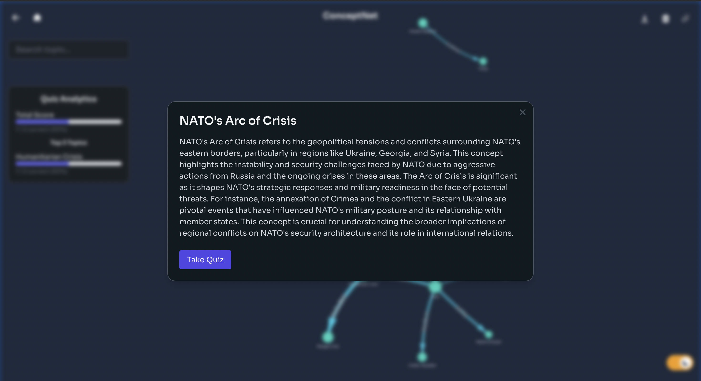
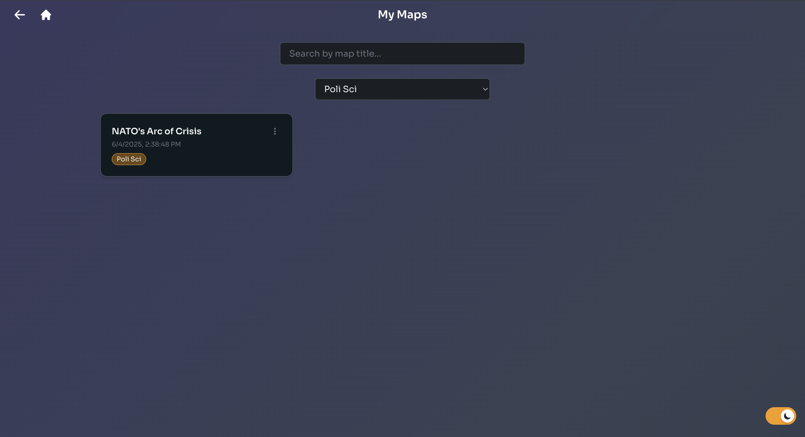

# 🧠 ConceptNet

Transform transcripts into interactive learning maps with built-in quizzes and analytics.  
Built for students who think visually, learn deeply, and study smarter.

[🌐 Live Demo](https://conceptnet.vercel.app)

---

## ✨ Features at a Glance

### 🌟 Landing Page
  
Clean, minimal entry point with animated particles and light/dark mode toggle.

---

### 🗂️ Create a Map

- Paste or upload `.pdf`, `.txt`, or `.docx`
- Auto-detect language and translate if needed
- Uses OpenAI to:
  - Build a concept graph
  - Summarize key nodes
  - Generate 3–5 quiz questions per node
- Caches graphs to Supabase by transcript hash

---

### 🧠 Map View

- Interactive Vis.js network of concepts
- Editable node + edge labels
- Search bar filters related nodes
- Quiz analytics panel with accuracy stats
- Export as PNG / JPG / PDF
- Lock node positions (Ctrl+Click)

---

### 🧾 Node Summary + Quiz

- Node modal shows 4–6 sentence summary
- MCQ quiz with shuffle, visual feedback, and local stats

---

### 🗃️ Gallery View

- All saved maps in localStorage
- Search + tag filtering
- Quick export or delete
- Inline tag editing

---

## 💻 Tech Stack

| Frontend                | Backend                | Storage       | AI/LLM APIs           |
|-------------------------|------------------------|----------------|------------------------|
| React + Tailwind        | FastAPI (Python)       | Supabase       | OpenAI `gpt-4o` mini      |
| Vis.js (network graph)  | PyMuPDF, docx, langdetect | LocalStorage   | Cohere Generate        |
| Framer Motion           | Docker for deployment  |                |                        |
| Deployed on Vercel      | Deployed on Render     |                
---

## 🌱 Motivation
As a visual learner, I often like to extract the big picture before diving deep into topics.
Built ConceptNet was built to combine:
- 🧾 structured summaries
- ❓ quick self-testing
- 🗺️ visual memory retention

It’s used by me and my friends to study smarter.

---

## 🛠 Wishlist / Future Features
- Upload recorded lectures (auto-transcribed)
- Custom prompt-based graph generation
- User auth for multi-device sync
